# Proyecto: Árboles Binarios (PreOrder, InOrder, PostOrder)

## Datos del Estudiante

* **Universidad:** Universidad Politécnica Salesiana
* **Carrera:** Ingeniería en Ciencias de la Computación
* **Nombre:** Angelo Miguel Carchipulla Pulla
* **Grupo:** Grupo 3 / 2do Ciclo
* **Fecha:** 17 de junio de 2026

---

## Descripción del Proyecto

Este proyecto es una implementación en **Java** enfocada en el estudio y manipulación de estructuras de datos no lineales, específicamente **Árboles Binarios**. Incluye la creación de nodos individuales, árboles para tipos de datos primitivos (como enteros) y árboles genéricos o adaptados para objetos personalizados, permitiendo realizar los recorridos clásicos de ordenamiento y búsqueda: **Preorden**, **Inorden** y **Postorden**.

---

## Estructura del Código 

El proyecto está organizado dentro del paquete de estructuras con las siguientes clases clave:

### 1. `Node.java`
* **Descripción:** Representa el componente básico (nodo) del árbol.
* **Lo que realiza:** Contiene el valor del nodo y las referencias (punteros) a sus hijos izquierdo y derecho (`left` y `right`).

### 2. `Person.java`
* **Descripción:** Clase modelo que define un objeto de tipo Persona (con atributos como nombre, edad, etc.).
* **Lo que realiza:** Sirve como el tipo de dato complejo para probar el comportamiento del árbol con objetos en lugar de tipos primitivos.

### 3. `IntTree.java`
* **Descripción:** Implementación de un árbol binario diseñado específicamente para manejar números enteros (`int`).
* **Lo que realiza:** Contiene los métodos para insertar elementos y ejecutar los recorridos básicos de forma sencilla.

### 4. `BinaryTrees.java`
* **Descripción:** La clase principal de la estructura del árbol (puede ser genérica o adaptada para interactuar con la clase `Person`).
* **Lo que realiza:** Controla la lógica principal del árbol binario, la inserción organizada de nodos y los métodos principales para los recorridos:
  * **PreOrden:** (Raíz, Izquierda, Derecha)
  * **InOrden:** (Izquierda, Raíz, Derecha)
  * **PostOrden:** (Izquierda, Derecha, Raíz)
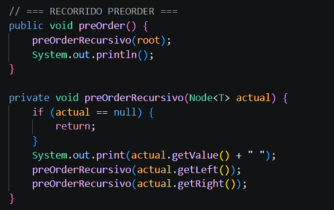
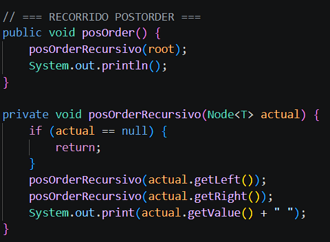
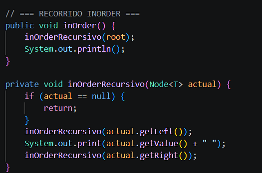
---

## Inserción de Datos (Insert)

La inserción se realiza bajo las reglas lógicas de un **BST**: los valores menores al nodo actual se desplazan y ubican en la rama izquierda, mientras que los valores mayores o iguales se direccionan a la derecha.
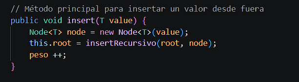
---

## Recorrido por Niveles o Anchura (BFS)

Este método implementa un recorrido en anchura apoyándose en una estructura de datos de tipo **Cola (Queue / LinkedList)**. Inspecciona el árbol horizontalmente de arriba hacia abajo, imprimiendo ordenadamente cada nivel completo de nodos.
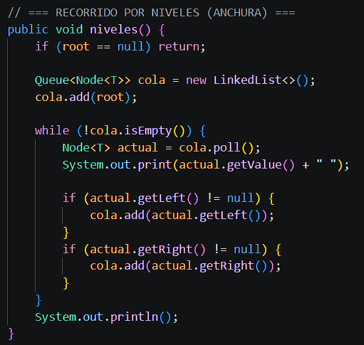

---

## Cálculo de Altura y Peso (Complejidad Temporal)
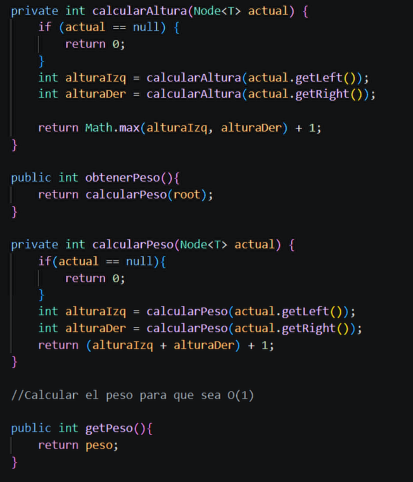

Algoritmos diseñados para evaluar las dimensiones y carga del árbol.

* `obtenerAltura()`: Mide de manera recursiva la longitud del camino más largo desde la raíz hasta una hoja, devolviendo el valor total del nivel máximo.
* `obtenerPeso()` / `calcularPeso()`: Cuenta de forma recursiva todos los nodos presentes en el árbol. Tiene una complejidad computacional de $O(n)$.
* `getPeso()`: Retorna directamente la variable modificada durante las inserciones. Esto optimiza el cálculo del peso reduciendo drásticamente su costo de procesamiento a una complejidad de tiempo constante $O(1)$.
* `insert(T value)`: Interfaz pública que incrementa el atributo `peso` en tiempo constante cada vez que se añade un nuevo elemento.
* `insertRecursivo(Node<T> actual, Node<T> nodeInsertar)`: Método auxiliar privado que navega recursivamente hasta hallar la posición exacta de inserción.

## Estructura y Conexiones del Grafo

Representa un grafo dirigido mediante listas de adyacencia, utilizando un mapa hash (`Map`) y conjuntos (`Set`) genéricos para mejorar la búsqueda de la mejor manera y asegurar la unicidad de las relaciones.

* `add(T data)`: Registra un nuevo vértice en el grafo de manera segura. Al mapear una clave de tipo `Node<T>` con un `HashSet<Node<T>>` vacío, prepara espacios para sus futuros vecinos con una complejidad de tiempo constante $O(1)$.
* `addConectionUni(T v1, T v2)`: Establece una arista dirigida (unidireccional) desde el nodo origen hacia el nodo destino. Tiene los datos genéricos en instancias de `Node<T>` y, tras asegurar la existencia de las claves en el mapa mediante `putIfAbsent()`, añade el destino al conjunto del origen. El uso de `Set` evita que se dupliquen conexiones idénticas.
* `printGraph()`: Método de visualización que recorre el mapa iterando sobre sus entradas (`Map.Entry`). Imprime en consola de forma estructurada cada nodo junto con el conjunto de vecinos a los que apunta.

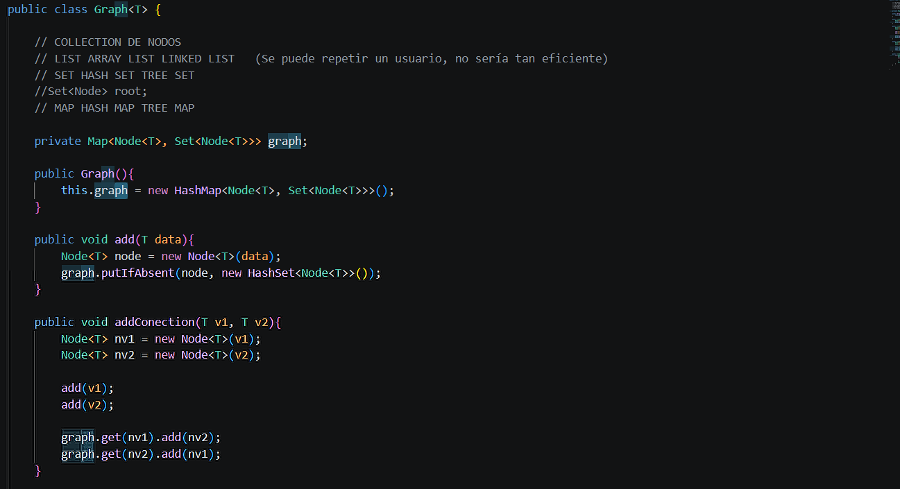
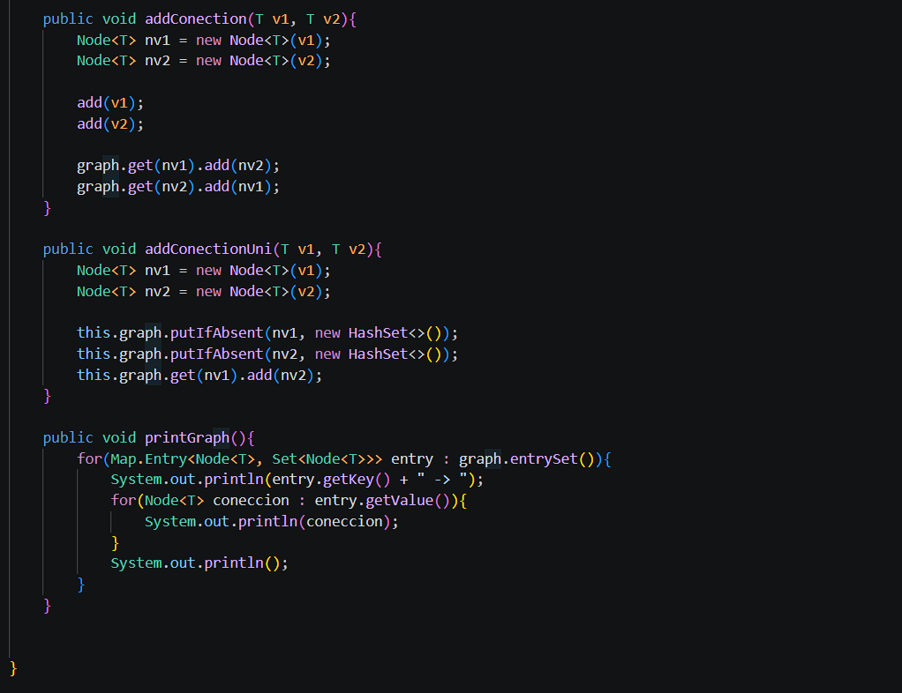

---

### 5. `App.java`
* **Descripción:** El punto de entrada del programa (`main`).
* **Lo que realiza:** Instancia las clases anteriores, quema o solicita datos de prueba, construye los árboles y muestra los resultados de los recorridos por la terminal.

### 6. `Capturas del App`
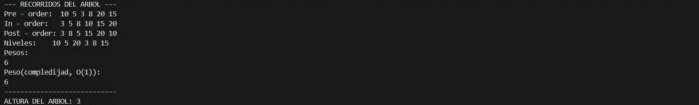
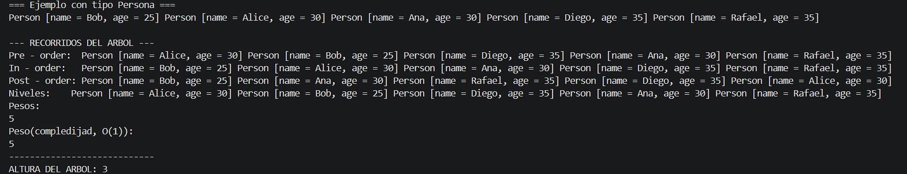
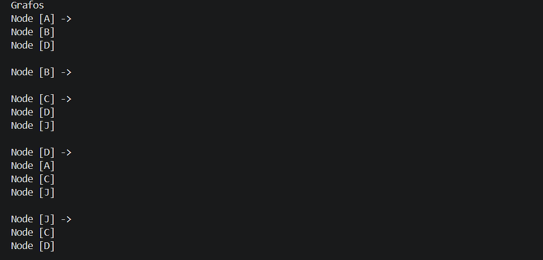