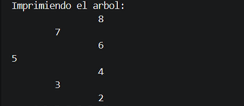
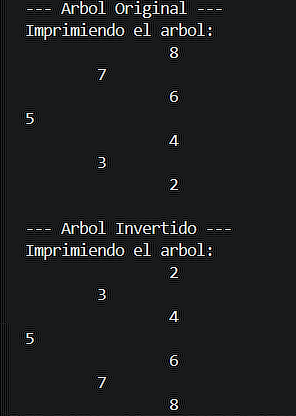

# Práctica 4: Ejercicios de lógica con estructuras no lineales: árboles

## Datos del Estudiante
* **Universidad:** Universidad Politécnica Salesiana
* **Carrera:** Computación
* **Asignatura:** Estructura de Datos – Segundo Interciclo
* **Estudiante:** Angelo Miguel Carchipulla Pulla

---

## Descripción general del proyecto
El proyecto busca mejorar la comprensión de la lógica de programación utilizando estructuras de datos no lineales, con **Árboles Binarios** y **Árboles Binarios de Búsqueda (BST)**. A través de distintos ejercicios, se realizan algoritmos fundamentales como la inserción de arreglos numéricos respetando las reglas de un BST, modo "espejo" del árbol, y recorridos visuales del mismo. Tiene una organización ya indicada en el documento el cual se seguir.

---

## Ejercicio 01: Insertar en BST

### Explicación de la lógica y del método `insert`
En este ejercicio se da la inserción de múltiples valores (provenientes de un arreglo de enteros) dentro de un Árbol Binario de Búsqueda (BST). La lógica cumple con el BST: todo valor menor a la raíz se inserta en el subárbol izquierdo, y todo valor mayor o igual se inserta en el subárbol derecho.

* **Método `insert(int[] numeros)`:** Recibe un arreglo de números enteros. Internamente instancia un árbol binario (`BinaryTrees<Integer>`), itera sobre cada elemento del arreglo y utiliza el método de inserción individual del árbol. Finalmente, invoca un método de impresión (`printTree`) que muestra el árbol en consola utilizando tabulaciones (`\t`) calculadas mediante la recursividad de derecha a izquierda, lo que permite visualizar el árbol acostado.

### Evidencia de Código (Ejercicio 01)
```java
public void insert(int[] numeros) {
    // Crear un árbol BST - instanciar BinaryTree
    BinaryTrees<Integer> tree = new BinaryTrees<>();

    // Insertar los números en el árbol
    for (int numero : numeros) {
        tree.insert(numero);
    }

    // Imprimir el árbol
    printTree(tree.getRoot());
}

public void printTree(Node<Integer> root) {
    System.out.println("Imprimiendo el árbol: ");
    printTreeRecursivo(root, 0);
}

private void printTreeRecursivo(Node<Integer> actual, int nivel) {
    // 1. Por si actual es null
    if (actual == null) {
        return;
    }

    // 2. Procesar primero el hijo DERECHO
    printTreeRecursivo(actual.getRight(), nivel + 1);

    // 3. Imprimir el nodo actual con tabulaciones según su nivel
    if (nivel != 0) {
        for (int i = 0; i < nivel - 1; i++) {
            System.out.print("\t");
        }
        System.out.println("\t" + actual.getValue());
    } else {
        // Es la raíz principal
        System.out.println(actual.getValue());
    }

    // 4. Procesar el hijo IZQUIERDO
    printTreeRecursivo(actual.getLeft(), nivel + 1);
}
```



## Ejercicio 02: Invertir árbol binario

### Explicación de la lógica y del método `invertTree`
El objetivo de este ejercicio es aplicar un efecto "espejo" a la estructura de un árbol binario. Esto significa que para cada nodo visitado, su hijo izquierdo pasará a ocupar la posición del hijo derecho, y viceversa, transformando físicamente la disposición de la estructura en memoria.

* **Lógica del algoritmo:** Se utiliza un enfoque de recorrido en profundidad (DFS) recursivo. Al evaluar cada nodo, primero se verifica si es nulo (caso base de la recursión). Si no lo es, se realiza un intercambio clásico de variables (*swap*) utilizando un nodo auxiliar `temporal` para almacenar la referencia izquierda antes de sobreescribirla con la derecha. Una vez hecho el intercambio en el nodo actual, se propagan los llamados recursivos hacia `root.getLeft()` y `root.getRight()` para repetir el proceso de manera descendente en todos los niveles inferiores del árbol.

### Evidencia de Código (Ejercicio 02)
```java
public Node<Integer> invert(Node<Integer> root) {
    // 1. Imprimir el árbol original para contrastar
    System.out.println("--- Arbol Original ---");
    printTree(root);

    // 2. Invertir la estructura físicamente en memoria
    invertRecursively(root);

    // 3. Imprimir el árbol modificado para verificar el efecto espejo
    System.out.println("\n--- Arbol Invertido ---");
    printTree(root);

    return root;
}

public void invertRecursively(Node<Integer> root) {
    // Caso base: si el nodo está vacío, detener la recursión
    if (root == null) {
        return;
    }

    // Intercambiar las referencias de los hijos (Swap)
    Node<Integer> temporal = root.getLeft();
    root.setLeft(root.getRight());
    root.setRight(temporal);

    // Llamados recursivos para aplicar el intercambio en los subárboles descendientes
    invertRecursively(root.getLeft());
    invertRecursively(root.getRight());
}
```


## Ejercicio 03: Listar Niveles en Listas Enlazadas

### Explicación de la lógica y del método `listLevels`
La idea de este ejercicio es separar los números del árbol según el "piso" o nivel en el que se encuentren. En lugar de ver la estructura colgada hacia abajo, lo que hago es agrupar los nodos horizontalmente en listas separadas por cada nivel. Al final, se junta todas estas listas para que en la consola se puedan imprimir en orden, fila por fila, usando flechas (` -> `) para que se entienda la secuencia de cada nivel.

* **Lógica del algoritmo:** Para lograr esto, uso una cola (`Queue`) como ayuda para revisar el árbol por niveles. Empiezo metiendo el nodo raíz. Con un ciclo `while` que corre mientras la cola tenga datos, calculo cuántos elementos hay en ese nivel exacto usando `queue.size()`. Luego, con un ciclo `for`, voy sacando cada nodo con `queue.poll()`, lo guardo en la lista del nivel actual y reviso si tiene un hijo izquierdo (`getLeft()`) o derecho (`getRight()`). Si tiene hijos, los meto a la cola para que se procesen cuando pasemos al siguiente piso. Por último, uso un método sencillo para imprimir los valores en pantalla poniendo las flechitas en medio de los números.

### Evidencia de Código (Ejercicio 03)
```java
import java.util.ArrayList;
import java.util.LinkedList;
import java.util.List;
import java.util.Queue;

public class Ejercicio3 {

    public void insert(int[] numeros) {
        // Crear un arbol BTS, instanciar BinaryTrees
        BinaryTrees<Integer> tree = new BinaryTrees<>();
        
        // Insertar los numeros en el arbol
        for(int numero : numeros) {
            tree.insert(numero);
        }
        
        // Imprimir los niveles del árbol
        printLevels(tree.getRoot());
    }

    // Recorrer las listas e imprimir con el formato de flechas
    private void printLevels(Node<Integer> root) {
        System.out.println("Output:");
        
        List<List<Node<Integer>>> resultado = listLevels(root);

        for (List<Node<Integer>> nivel : resultado) {
            for (int i = 0; i < nivel.size(); i++) {
                System.out.print(nivel.get(i).getValue()); 
                
                // Imprimir flecha SOLO si no es el último nodo del nivel actual
                if (i < nivel.size() - 1) {
                    System.out.print(" -> ");
                }
            }
            System.out.println(); 
        }
        System.out.println();
    }

    // Separa los nodos por niveles (BFS)
    private List<List<Node<Integer>>> listLevels(Node<Integer> root) {
        List<List<Node<Integer>>> result = new ArrayList<>();
        
        if (root == null) {
            return result;
        }

        Queue<Node<Integer>> queue = new LinkedList<>();
        queue.offer(root);

        while (!queue.isEmpty()) {
            int levelSize = queue.size();
            List<Node<Integer>> currentLevelList = new LinkedList<>();

            for (int i = 0; i < levelSize; i++) {
                Node<Integer> actual = queue.poll();
                currentLevelList.add(actual);

                if (actual.getLeft() != null) {
                    queue.offer(actual.getLeft());
                }
                
                if (actual.getRight() != null) {
                    queue.offer(actual.getRight());
                }
            }
            
            result.add(currentLevelList);
        }

        return result;
    }
}
```

## Ejercicio 04: Calcular la Profundidad Máxima

### Explicación de la lógica y del método `maxDepth`
En este ejercicio lo que busco es calcular la altura o la profundidad máxima del árbol. Se trata de contar cuántos nodos hay en el camino más largo posible desde el primer número (la raíz) hasta el número que haya quedado en el fondo del todo (la hoja más profunda).

* **Lógica del algoritmo:** Para resolver esto uso recursividad, haciendo que el método se llame a sí mismo para ir bajando por las ramas. El truco está en el caso base: si el nodo actual está vacío (`null`), significa que llegué al final de un camino y devuelvo `0`. Si no está vacío, calculo por separado la profundidad de la rama izquierda en la variable `leftDepth` y la de la derecha en `rightDepth`. Al final, uso un `if-else` para comparar cuál de los dos lados llegó más lejos, y al número que sea mayor le sumo `1` (para contar el nodo en el que estoy parado en ese momento) antes de mandar el resultado final hacia arriba.

### Evidencia de Código (Ejercicio 04)
```java
public class Ejercicio4 {

    public void insert(int[] numeros) {
        // Crear un arbol BTS - instanciar BinaryTrees
        BinaryTrees<Integer> tree = new BinaryTrees<>();
        
        // Insertar los numeros en el arbol
        for(int numero : numeros) {
            tree.insert(numero);
        }
        
        // Calcular la profundidad máxima e imprimirla
        int profundidad = maxDepth(tree.getRoot());
        System.out.println("Output: " + profundidad);
        System.out.println();
    }

    // Calcular la profundidad máxima
    private int maxDepth(Node<Integer> root) {
        // Caso base: si el nodo es null, no suma profundidad
        if (root == null) {
            return 0;
        }

        // Calcular la profundidad de las ramas izquierda y derecha de forma recursiva
        int leftDepth = maxDepth(root.getLeft());
        int rightDepth = maxDepth(root.getRight());

        // Evaluar explícitamente qué camino es más largo y sumar el nodo actual (+1)
        if (leftDepth > rightDepth) {
            return leftDepth + 1;
        } else {
            return rightDepth + 1;
        }
    }
}
``` 
